 

I'm Dishant, a **computer engineer** with over five years of experience in **graphic, product, and industrial design**.

I build software tools, explore AI and automation, and prototype physical products. I also run **Danger.Labs**.

 

### What I care about in design

**Clear hierarchy. Good typography. Room to breathe.**

I like interfaces that make the next step obvious and details that serve a purpose. The same care belongs in a physical product: how it looks, how it feels, and how someone uses it.

 

### Technologies in my projects

  &nbsp;
  &nbsp;
  &nbsp;
  &nbsp;
  &nbsp;
  

 

---

Read at your own pace

### How I work

**Research → Reuse → Prototype → Test → Simplify**

I start by understanding the problem and checking what already exists. Open-source tools are often a good starting point. The wheel has had enough relaunches.

Then I make something I can test, refine what matters, and remove what gets in the way.

 

### What I'm exploring in software

AI tools, automation, and developer workflows interest me most when they take friction out of an actual task. I like experimenting, but I want to understand where the tool earns its place.

 

### Beyond the screen

My interests also extend to 3D prototyping, robotics, IoT, and manufacturing. I want to understand how a design becomes something that can be made, used, and improved.

The business side matters to me too: who needs it, what it costs to make, and whether it is worth pursuing.

 

### What I'm looking for

Problems where my design experience and engineering background can both be useful. I value a clear need, room to experiment, and the chance to take responsibility for the whole product.

 

### What I'm working toward

I want to develop and maintain my own digital and physical products, from the first design decisions through everyday use.

Right now, that means stronger engineering, better testing, and choosing which ideas deserve sustained attention.

 

---

&nbsp; [All repositories](https://github.com/dr-week?tab=repositories)
