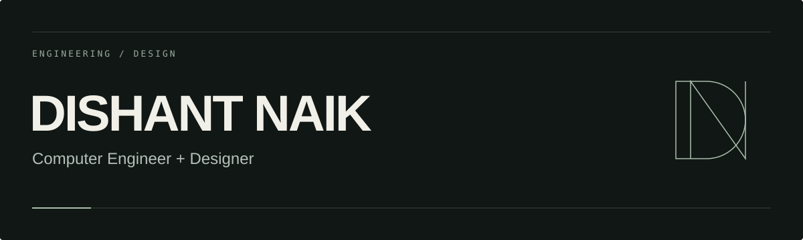

### A little about me

I'm a computer engineer with over five years of work in craft and industrial design. These days, I also build software, interfaces, and AI tools.

I care about how things look, how they work, and whether anyone needs them in the first place. Apparently, that last part is optional.

My company · <strong>Ginger.DVR</strong>

 

### Selected work

**[Phone Case Maker](https://github.com/dr-week/Phone-case-maker-2D-3D)**  
A browser CAD tool for custom phone cases and 3D printing.

**[Code to Design](https://github.com/dr-week/Code-To-Figma-Converter)**  
Converts Vue interfaces into editable OpenPencil and Figma layers.

**[NOCUT](https://github.com/dr-week/no-cut-editor)**  
An automated video editor with social media templates. In beta.

 

### What comes next

I'm building independent software products and deepening my engineering skills along the way. My approach is simple: understand the problem, reuse what works, test, and refine.

---

&nbsp; [Explore my work](https://github.com/dr-week?tab=repositories)
